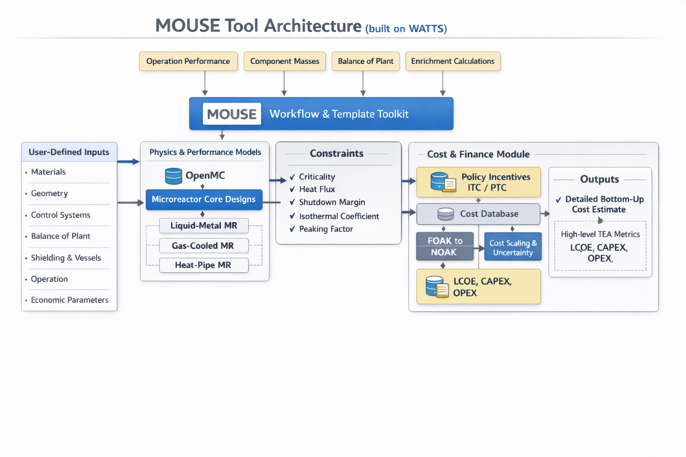

# Microreactor Optimization Using Simulation and Economics (MOUSE) 
## Motivation
The rising interest in nuclear microreactors has highlighted the need for comprehensive technoeconomic assessments. However, the scarcity of publicly available designs and cost data has posed significant challenges. The Microreactor Optimization Using Simulation and Economics (MOUSE) tool addresses this gap by integrating nuclear microreactor design with reactor economics.

## Description

MOUSE leverages the [OpenMC](https://github.com/openmc-dev/openmc) Monte Carlo Particle Transport Code to perform detailed core simulations for various microreactor designs, including Liquid Metal Thermal Microreactors (LMTR), Gas-Cooled TRISO-Fueled Microreactors (GCMR), and Heat Pipe Microreactors. It includes simplified calculations for balance of plant and operational performance. Economically, MOUSE provides bottom-up cost estimates covering preconstruction, direct, indirect, training, financial, O&M, and fuel costs. It calculates total capital costs and the levelized cost of energy (LCOE) for both first-of-a-kind and nth-of-a-kind microreactors using data from the MARVEL project and other literature.

## MOUSE Tool Structure


### User-Defined Inputs
Users can modify design inputs or economic inputs ruch as:
- Overall System: Reactor Power (MWt), Thermal Efficiency (%), Heat Flux Criteria
- Geometry: Fuel Pin Radii, TRISO Packing Fraction, Coolant Channel Radius, Moderator Booster Radius, Lattice Pitch, Rings per Assembly, Assemblies per Core, Core Active Height, Reflector Thickness, Control Drum Dimensions
- Materials: Fuel, Enrichment, Coolant, Reflector, Matrix Material, Moderator, Moderator Booster, Control Drum Absorber/Reflector, Fuel Pin Materials
- Shielding: In/Out Vessel Shield Thickness, Material, Dimensions
- Vessels: Vessel Radius, Thickness, Materials, Gaps Between Vessels
- Balance of Plant: Coolant Inlet/Outlet Temperatures, Compressor Pressure Ratio, Pump Efficiency
- Operation: Operation Mode, Number of Operators, Plant Lifetime, Refueling Period, Number of Emergency Shutdowns per Year, Startup Durations
- Buildings: Dimensions of Reactor, Turbine, Control, Refueling, Spent Fuel, Emergency, Storage, Radioactive Waste Buildings
- Economic Parameters: Interest Rate, Dollar Escalation Year, Construction Duration, Debt to Equity Ratio

MOUSE is powered by the Workflow and Template Toolkit for Simulation ([WATTS](https://github.com/watts-dev/watts)), developed by ANL, which facilitates parametric studies by integrating various code components.

### Microreactor Designs
Three reactor designs are included so far:
- Liquid-metal thermal microreactor (LTMR)
- Gas-cooled microreactor (GCMR)
- Heat pipe microreactor (HPMR)

The designs can be found [here](./assets/Ref_openmc_2d_designs)


## Prerequisites
Before running the MOUSE code, ensure that the following packages are installed:
- [OpenMC](https://github.com/openmc-dev/openmc)
- [WATTS](https://github.com/watts-dev/watts)

### Getting started
The user can specifiy the reactor design specs and/or the economics parameters for the LTMR and GCMR in the files
`watts_exec_LTMR.py` or `watts_exec_GCMR_Design_A.py` or `watts_exec_HPMR.py`

A complete detailed bottom up cost estimation is obtained by running commands such as
```
python -m examples.watts_exec_LTMR
```
```
python -m examples.watts_exec_GCMR_Design_A
```
```
python -m examples.watts_exec_HPMR
```
Examples of the results are [here](./assets/Ref_Results)